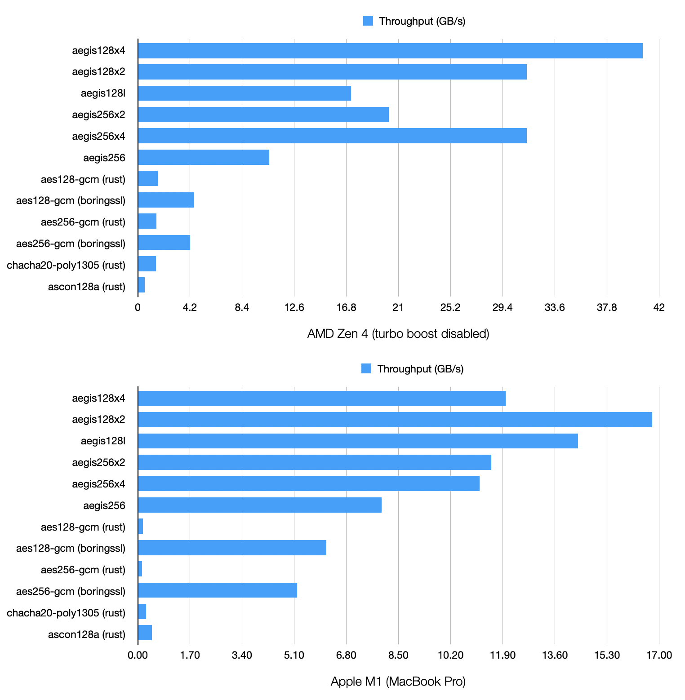
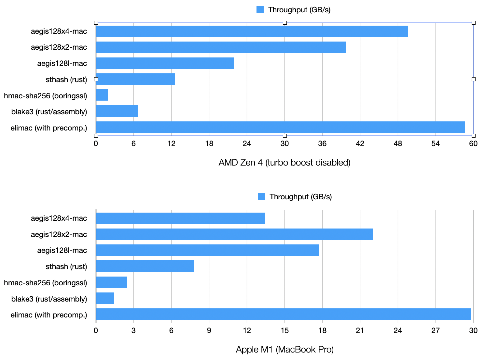
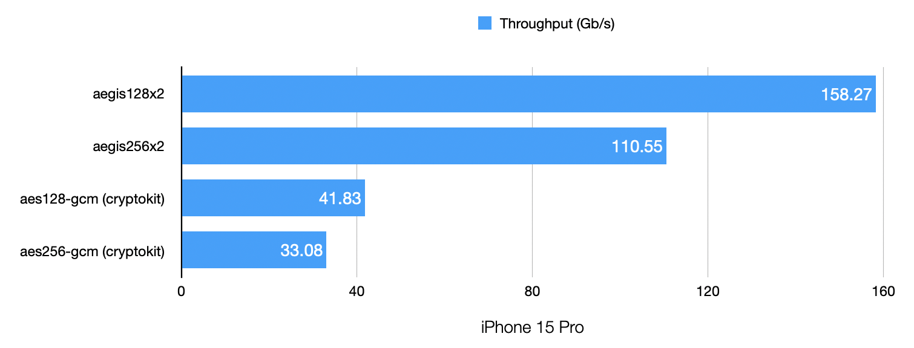

# libaegis

Portable C implementations of the [AEGIS](https://datatracker.ietf.org/doc/draft-irtf-cfrg-aegis-aead/) family of high-performance authenticated ciphers (AEGIS-128L, AEGIS-128X2, AEGIS-128X4, AEGIS-256, AEGIS-256X2, AEGIS-256X4), with runtime CPU detection.

## Features

- AEGIS-128L with 16 and 32 bytes tags (software, AES-NI, ARM Crypto)
- AEGIS-128X2 with 16 and 32 bytes tags (software, VAES + AVX2, AES-NI, ARM Crypto)
- AEGIS-128X4 with 16 and 32 bytes tags (software, AVX512, VAES + AVX2, AES-NI, ARM Crypto)
- AEGIS-256 with 16 and 32 bytes tags (software, AES-NI, ARM Crypto)
- AEGIS-256X2 with 16 and 32 bytes tags (software, VAES + AVX2, AES-NI, ARM Crypto)
- AEGIS-256X4 with 16 and 32 bytes tags (software, AVX512, VAES + AVX2, AES-NI, ARM Crypto)
- All variants of AEGIS-MAC, supporting incremental updates.
- Encryption and decryption with attached and detached tags
- Incremental encryption and decryption.
- Unauthenticated encryption and decryption (not recommended - only implemented for specific protocols)
- Deterministic pseudorandom stream generation.

## Installation

Note that the compiler makes a difference. Zig (or a recent `clang` with target-specific options such as `-march=native`) produces more efficient code than `gcc`.

### Compilation with `zig`:

```sh
zig build -Drelease
```

The library and headers are installed in the `zig-out` folder.

To favor performance over side-channel mitigations on devices without hardware acceleration, add `-Dfavor-performance`:

```sh
zig build -Drelease -Dfavor-performance
```

A benchmark can also be built with the `-Dwith-benchmark` option:

```sh
zig build -Drelease -Dfavor-performance -Dwith-benchmark
```

`libaegis` doesn't need WASI nor any extension to work on WebAssembly. The `wasm32-freestanding` target is fully supported.

WebAssembly extensions such as `bulk_memory` and `simd128` can be enabled by adding `-Dcpu=baseline+bulk_memory+simd128` to the command line.

### Compilation with `cmake`:

```sh
mkdir build
cd build
cmake -DCMAKE_INSTALL_PREFIX=/install/prefix ..
make install
```

To favor performance over side-channel mitigations on devices without hardware acceleration, add `-DFAVOR_PERFORMANCE`.

### Direct inclusion

Copy everything in `src` directly into your project, and compile everything like regular C code. No special configuration is required.

## Usage

Include `<aegis.h>` and call `aegis_init()` prior to doing anything else with the library.

`aegis_init()` checks the CPU capabilities in order to later use the fastest implementations.

## Bindings

* [`aegis`](https://crates.io/crates/aegis) is a set of bindings for Rust.

## Libaegis users

* [`fizz`](https://github.com/facebookincubator/fizz) is Facebook's implementation of TLS 1.3.
* [`picotls`](https://github.com/h2o/picotls) is a TLS 1.3 implementation in C, with support for the AEGIS cipher suites.
* [`h2o`](https://h2o.examp1e.net) is an HTTP/{1,2,3} server with support for the AEGIS cipher suites.

## Other implementations

[Other AEGIS implementations](https://github.com/cfrg/draft-irtf-cfrg-aegis-aead?tab=readme-ov-file#known-implementations) are also available for most programming languages.

## Benchmarks

AEGIS is very fast on CPUs with parallel execution pipelines and AES support.

### Encryption (16 KB)



### Authentication (64 KB)



### Mobile benchmarks

